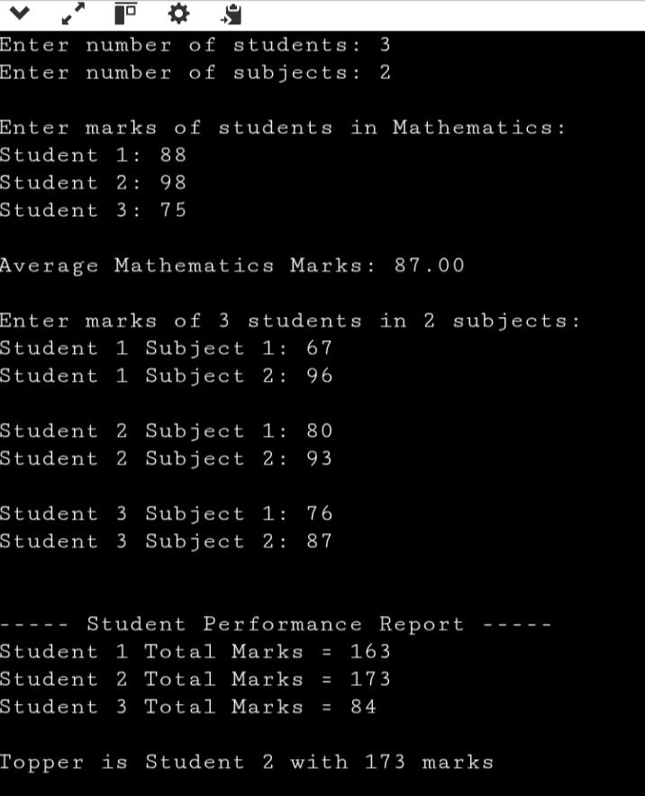

# 🎓College Internal Marks Management System (C)

## 🧾Description
This project implements a simple college internal marks management system using the C programming language.  
It demonstrates how pointers are used with 1-D and 2-D arrays to store, access, and process student marks.

The program calculates average marks for a subject, total marks for each student, and identifies the class topper using pointer arithmetic and pointer expressions.

---

## ✨Features
- Stores marks for one subject using a 1-D array
- Stores marks for multiple subjects using a 2-D array
- Uses pointers to access array elements
- Demonstrates pointer arithmetic and pointer expressions
- Calculates average marks
- Calculates total marks per student
- Identifies the topper

---

## 🧩Concepts Used
- C Arrays (1-D and 2-D)
- Pointers
- Pointer arithmetic
- Pointer expressions
- Loops and nested loops
- User input using `scanf`

---

## 🔁Program Flow
1. User enters the number of students and subjects
2. Marks for one subject are stored using a pointer
3. Average marks are calculated
4. Marks for multiple subjects are stored using a pointer to a 2-D array
5. Total marks for each student are calculated
6. Topper is identified based on total marks

---

## 📸Output Screenshot
Below is a screenshot showing the execution and output of the program.

---

## ▶️How to Compile and Run
1️⃣Write code  
→ Pointers.c  
2️⃣ Compile it  
→ gcc Pointers.c -o Pointers  
3️⃣ Run it  
→ ./Pointers

---
## 📂File Structure
Pointers.c    // Main C source file  
README.md  // Project documentation

---
## ⚠️Limitations
- Assumes valid integer input
- No data persistence (data is lost after program ends)
- Does not include grade calculation

---

## 🚀Future Improvements
- Use dynamic memory allocation (`malloc`)
- Add grade calculation
- Store marks in files
- Convert into a menu-driven program

---

## 👩🏻‍💻Author
Name: Shravani Thouta  
Course: C Programming
